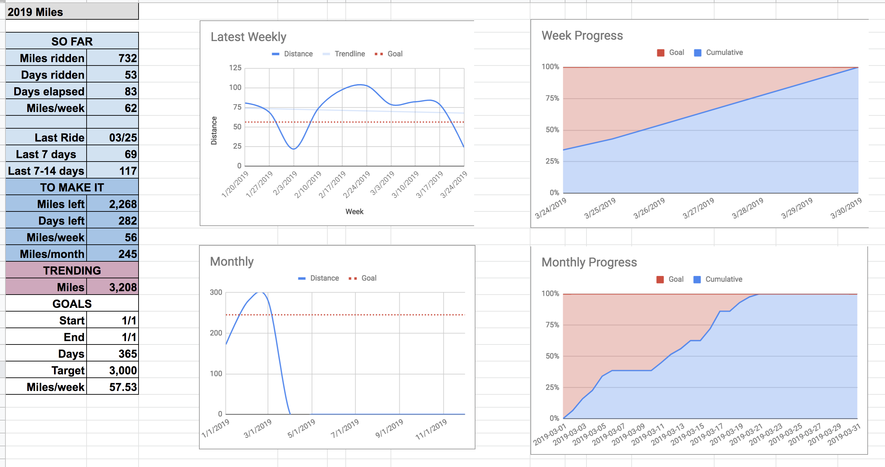

Strava Dashboard is a Google App Script to create a dashboard view of your strava work.

To use:
 - Copy the spreadsheet
 - Add the script add-on
 - Configure the script using Script Properties
 - Run

 Clasp may be able to help with the process.

## Example Dashboard

